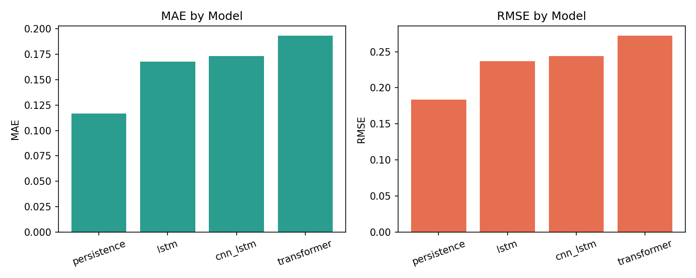
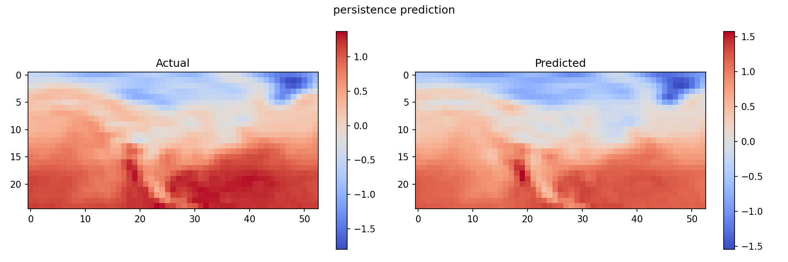
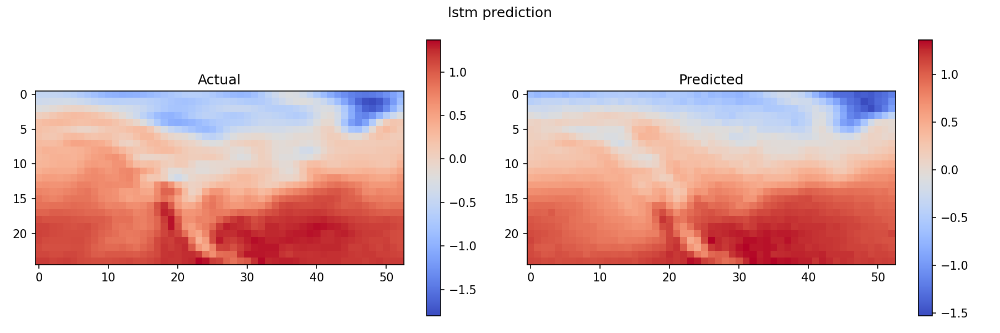
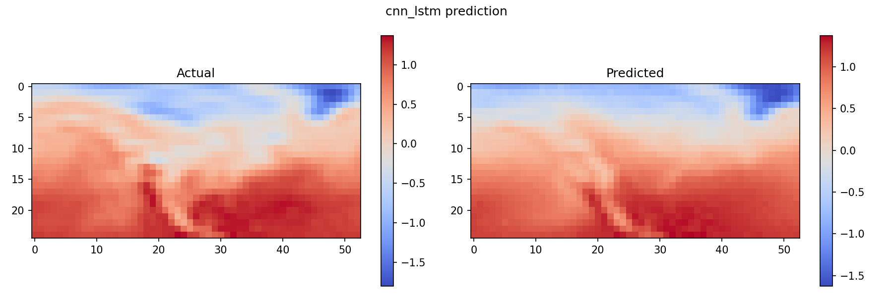
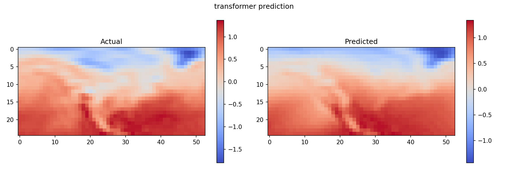
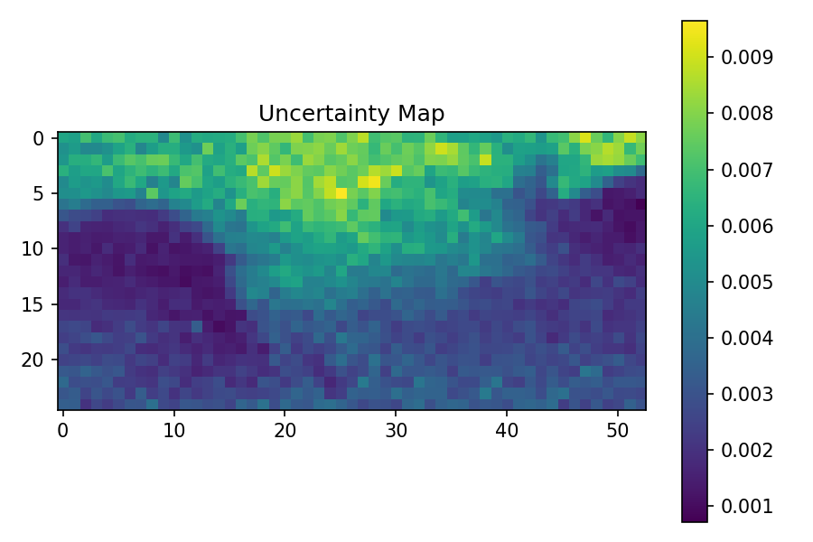

# Uncertainty-Aware Spatio-Temporal Deep Learning for Short-Term Weather Forecasting

## Abstract
This project develops a full deep learning research pipeline for multi-step weather forecasting on gridded data. The system benchmarks four model classes (Persistence, LSTM, CNN-LSTM, Transformer), supports both synthetic and real NetCDF data, and generates quantitative comparisons plus uncertainty visualizations via Monte Carlo Dropout.  

Two evaluation tracks were executed:
1. Synthetic benchmark (`outputs_proper`), used to stress-test architecture behavior.
2. Real small weather subset (`outputs_open_air`), used to validate real-data training on limited hardware.

---

## 1. Problem Statement
Given historical weather maps:

- Input: `X in R^(B, Tin, C, H, W)`
- Output: `Y in R^(B, Tout, C, H, W)`

where:
- `Tin` = input timesteps,
- `Tout` = forecast horizon,
- `C` = meteorological variables,
- `H x W` = spatial grid.

Goal: learn a model that minimizes forecast error and provides uncertainty estimates.

---

## 2. Research Objectives
1. Build a reproducible forecasting pipeline from training to reporting.
2. Compare classical and deep baselines under a common protocol.
3. Support real weather datasets under low-memory constraints.
4. Visualize forecast quality and predictive uncertainty.

---

## 3. Project Architecture
Core modules:

- `src/data_loader.py`: dataset loading, chronological split, normalization, sequence windowing.
- `src/preprocess.py`: NetCDF to NPZ conversion for ERA5-like workflows.
- `src/train.py`: model training + checkpointing.
- `src/evaluate.py`: metric computation + prediction figure output.
- `src/inference.py`: MC Dropout uncertainty mapping.
- `src/run_full.py`: complete orchestration (all models, summary metrics, comparison plots).
- `src/models/`: Persistence, LSTM, CNN-LSTM, Transformer.
- `main.py`: command entrypoint (`train`, `evaluate`, `predict`, `full`).

---

## 4. Data and Preprocessing
### 4.1 Synthetic Benchmark
- Source: `data/sample/synthetic_weather.npz`
- Purpose: controlled benchmark and model debugging.

### 4.2 Real Data Subset (used in latest run)
- Source file: `data/open/air_temperature.nc`
- Dimensions: `time=2920`, `lat=25`, `lon=53`
- Variable used: `air`

### 4.3 Split + Normalization Strategy
- Chronological split: train / validation / test.
- Mean/std computed only on train split, then applied to val/test.
- Sequence windows generated with configurable `input_steps` and `forecast_steps`.

---

## 5. Models Evaluated
1. **Persistence**: repeats latest observed frame.
2. **LSTM**: flattened spatial grid per step + temporal recurrence.
3. **CNN-LSTM**: spatial feature encoder + temporal LSTM.
4. **Transformer**: patch embedding + transformer encoder + regression head.

---

## 6. Experimental Setup
### 6.1 Metrics
- MAE
- RMSE
- R2

### 6.2 Execution
Full run command:

```bash
python main.py full --config <config.yaml>
```

Used configs:
- Synthetic detailed run: `configs/proper_run.yaml`
- Real data run: `configs/open_air.yaml`

---

## 7. Quantitative Results
## 7.1 Synthetic Benchmark (`outputs_proper/metrics/summary.json`)
| Model | MAE | RMSE | R2 |
|---|---:|---:|---:|
| Persistence | 0.6707 | 0.9159 | 0.1614 |
| LSTM | 0.3483 | 0.4997 | 0.7504 |
| CNN-LSTM | **0.2984** | **0.4697** | **0.7795** |
| Transformer | 0.8198 | 0.9900 | 0.0203 |

Observation: CNN-LSTM is strongest; Transformer underfits this setting.

## 7.2 Real Data Subset (`outputs_open_air/metrics/summary.json`)
| Model | MAE | RMSE | R2 |
|---|---:|---:|---:|
| Persistence | **0.1169** | **0.1835** | **0.9660** |
| LSTM | 0.1681 | 0.2370 | 0.9433 |
| CNN-LSTM | 0.1732 | 0.2437 | 0.9401 |
| Transformer | 0.1933 | 0.2721 | 0.9252 |

Observation: In this specific single-variable, smooth-field subset, persistence is very strong.

---

## 8. Figure-Based Result Analysis
### Figure 1. Overall metric comparison (latest real-data run)


Interpretation:
- Persistence has the lowest MAE/RMSE.
- Deep models are close but not better in this short-horizon smooth regime.

### Figure 2. Persistence forecast vs actual


Interpretation:
- Spatial structures are preserved well.
- Indicates strong temporal autocorrelation in this dataset.

### Figure 3. LSTM forecast vs actual


Interpretation:
- LSTM captures broad-scale gradients.
- Slight amplitude/shape smoothing vs ground truth.

### Figure 4. CNN-LSTM forecast vs actual


Interpretation:
- Strong spatial reconstruction quality.
- Comparable visual quality to LSTM in this run.

### Figure 5. Transformer forecast vs actual


Interpretation:
- Forecast is coherent but less accurate than other models.
- Suggests current transformer hyperparameters are not optimal for this subset.

### Figure 6. Transformer MC Dropout uncertainty map


Interpretation:
- Higher-variance regions are identifiable.
- Uncertainty is available, but model calibration should be further evaluated on larger real datasets.

---

## 9. Discussion
### 9.1 Why persistence can win on this real subset
- Single variable (`air`) at moderate resolution.
- Strong temporal continuity and limited abrupt dynamics.
- Short prediction horizon (`input_steps=8`, `forecast_steps=4`).

### 9.2 Why transformer lagged
- Limited data complexity and constrained training budget.
- Patch/hyperparameter choice may not fit this grid/time setting.
- Attention models often need more tuning/data diversity than recurrent baselines in compact regimes.

### 9.3 What this means for research positioning
- Pipeline quality is strong (reproducible, multi-model, uncertainty-aware).
- Scientific claim should be calibrated: architecture ranking is dataset-regime dependent.

---

## 10. Limitations
1. Real-data experiment used a small open subset (not full ERA5 benchmark).
2. No full ablation grid over hyperparameters.
3. No calibration metrics (e.g., CRPS, reliability diagrams) yet.
4. Single-variable real-data run; multi-variable behavior may differ.

---

## 11. Future Work
1. Run multi-variable ERA5 small regional subsets after license acceptance.
2. Add horizon-wise metrics and per-variable breakdown.
3. Add transformer-specific tuning study (patch size, depth, learning schedule).
4. Add probabilistic verification metrics for uncertainty quality.
5. Track all runs with experiment metadata and confidence intervals over multiple seeds.

---

## 12. Reproducibility Commands
Install:

```bash
pip install -r requirements.txt
```

Run full synthetic benchmark:

```bash
python main.py full --config configs/proper_run.yaml
```

Run full real subset benchmark:

```bash
python main.py full --config configs/open_air.yaml
```

---

## 13. Conclusion
This project delivers a complete research pipeline for spatio-temporal weather forecasting with baseline benchmarking, uncertainty output, and report-ready artifacts.  

Current evidence shows:
- strong baseline behavior under smooth real-data dynamics (Persistence),
- competitive recurrent models (LSTM, CNN-LSTM),
- a Transformer path that is functional but requires further tuning and broader real-data evaluation.

